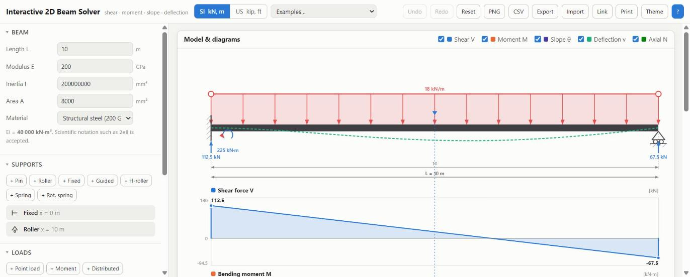

<h1 align="center">Interactive 2D Beam Solver</h1>

<p align="center">
  Drag supports and loads onto a beam. Get shear, moment and deflection — live.<br>
  One HTML file. No server, no dependencies, works offline.
</p>

<p align="center">
  <a href="https://github.com/mojtaba-ja/interactive-2d-beam-solver/actions/workflows/ci.yml"></a>
  
  
</p>

<p align="center">
  
</p>

<p align="center">
  <a href="https://mojtaba-ja.github.io/interactive-2d-beam-solver/"><b>▶&nbsp; Try it</b></a>
  &nbsp;&nbsp;·&nbsp;&nbsp;
  <a href="https://github.com/mojtaba-ja/interactive-2d-beam-solver/raw/main/dist/Interactive-2D-Beam-Solver.html"><b>⬇&nbsp; Download</b></a>
</p>

---

- **Drag to edit** — supports, loads, load extents. Buttons add new ones. Double-click to drop a point load.
- **Hover anywhere** for `N`, `V`, `M`, `θ`, `v` at that section, across every diagram at once.
- **Indeterminate beams too** — continuous, propped, fixed-ended, Gerber. Same solver.
- **7 supports** — pin, roller, fixed, guided, h-roller, spring, rotational spring. Plus settlements and imposed rotations.
- **6 loads** — point (any angle), moment, uniform, triangular, trapezoidal, axial, distributed moment.
- **Internal hinges** and shear releases.
- **SI / US units**, dark mode, undo/redo, 14 examples.
- **Export** — PNG, CSV, JSON, shareable link, printable report.

## Quick start

<a href="https://mojtaba-ja.github.io/interactive-2d-beam-solver/"><b>▶&nbsp; Download the single file</b></a> and open it. That's it.

From source:

```bash
git clone https://github.com/mojtaba-ja/interactive-2d-beam-solver.git
open index.html      # no build step needed to run it
node build.js        # rebuild dist/ after editing
node tests/solver.test.js
```

<details>
<summary><b>Sign conventions</b></summary>

<br>

**In** — force and line load `+` down · moment `+` clockwise · settlement `+` down · load angle tilts toward `+x`. Negative flips it.

**Out** — `V` = upward forces left of the cut · `M` `+` sagging · `N` `+` tension · `v`, `θ`, `Ry` `+` up / CCW.

The moment diagram can be flipped to the tension-side convention.

</details>

<details>
<summary><b>How it works</b></summary>

<br>

Direct stiffness method, two-node Euler–Bernoulli elements, with a node at every support, release, point load and line-load boundary. That meshing makes the consistent load vector exact, so the nodal displacements are exact for the governing ODE.

`N`, `V` and `M` are then integrated directly from the applied loads plus the computed reactions — exact and mesh-independent. Slope and deflection use the exact element solution, `v = Hermite(v₁,θ₁,v₂,θ₂) + v_p`, where `v_p` solves `EI·v'''' = q − dm/dx` clamped-clamped. Neither is sampled or interpolated.

Releases split the degree of freedom at the node instead of using a penalty. Settlements are prescribed displacements; spring reactions come out of the same residual `K₀d − F₀` as every other reaction.

**Assumes** linear elastic, small displacements, constant `EI`, bending only — shear deformation neglected.

</details>

<details>
<summary><b>Validation — 167 assertions, 28 cases</b></summary>

<br>

```bash
node tests/solver.test.js
```

Checked against published closed-form solutions: simple spans, cantilevers, overhangs, propped cantilevers, fixed-ended beams, two- and three-span continuous beams, triangular and trapezoidal loads, end moments, distributed moments, internal hinges, settlement, springs, guided supports, axial and inclined loads.

Every case additionally verifies:

- `EI·v''(x) = M(x)` at interior stations — deflected shape and moment diagram are computed by independent routes and must agree
- global equilibrium of loads against computed reactions
- superposition across three simultaneous loads
- mesh independence — redundant nodes must not change any answer

CI runs all of it on every push, and fails if `dist/` has drifted from source.

</details>

<details>
<summary><b>Keyboard & mouse</b></summary>

<br>

| | |
|---|---|
| Drag | move an object; round handles set a load's extent |
| <kbd>Alt</kbd> + drag | ignore the snap grid |
| Double-click | drop a point load |
| Click a diagram | move the section marker |
| <kbd>←</kbd> <kbd>→</kbd> | nudge selection (<kbd>Shift</kbd> = ×5) |
| <kbd>Del</kbd> | delete · <kbd>Esc</kbd> deselect |
| <kbd>Ctrl</kbd>+<kbd>Z</kbd> / <kbd>Y</kbd> | undo / redo |
| <kbd>?</kbd> | help |

</details>

<details>
<summary><b>Project structure</b></summary>

<br>

```
index.html            page structure
css/styles.css        styling, themes, print layout
js/solver.js          analysis engine — no DOM, runs under Node
js/render.js          SVG scene and diagrams
js/app.js             state, editing, results, import/export
js/units.js           SI/US units and formatting
tests/solver.test.js  validation suite
build.js              bundles everything into dist/
```

The model is stored in SI base units throughout; switching to US units changes the display only, never the structure.

</details>

<br>

[MIT](LICENSE) © Mojtaba Jafarian Abyaneh
