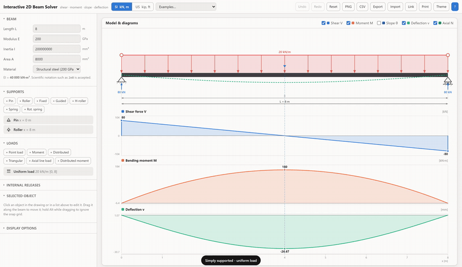

<h1 align="center">Interactive 2D Beam Solver</h1>

<p align="center">
  Drag supports and loads onto a beam. Get shear, moment and deflection — live.<br>
  One HTML file. No server, no dependencies, works offline.
</p>

<p align="center">
  <a href="https://github.com/mojtaba-ja/interactive-2d-beam-solver/actions/workflows/ci.yml"></a>
  
  
</p>

<p align="center">
  
</p>

<p align="center">
  <sub><a href="docs/demo.mp4">Watch the same demo as MP4</a> &middot; sharper, 1600&times;924</sub>
</p>

<p align="center">
  <a href="https://mojtaba-ja.github.io/interactive-2d-beam-solver/"><b>▶&nbsp; Try it</b></a>
  &nbsp;&nbsp;·&nbsp;&nbsp;
  <a href="https://github.com/mojtaba-ja/interactive-2d-beam-solver/raw/main/dist/Interactive-2D-Beam-Solver.html"><b>⬇&nbsp; Download</b></a>
</p>

---

- **Drag to edit** — supports, loads, load extents. Buttons add new ones. Double-click to drop a point load.
- **Hover anywhere** for `N`, `V`, `M`, `θ`, `v` at that section, across every diagram at once.
- **Indeterminate beams too** — continuous, propped, fixed-ended, Gerber. Same solver.
- **7 supports** — pin, roller, fixed, guided, h-roller, spring, rotational spring. Plus settlements and imposed rotations.
- **6 loads** — point (any angle), moment, uniform, triangular, trapezoidal, axial, distributed moment.
- **Internal hinges** and shear releases.
- **SI / US units**, dark mode, undo/redo, 14 examples.
- **Export** — PNG, CSV, JSON, shareable link, printable report.

## Quick start

<a href="https://mojtaba-ja.github.io/interactive-2d-beam-solver/"><b>▶&nbsp; Open it in your browser</b></a> — nothing to install.

<a href="https://github.com/mojtaba-ja/interactive-2d-beam-solver/raw/main/dist/Interactive-2D-Beam-Solver.html"><b>⬇&nbsp; Download the single file</b></a> — one HTML file, double-click to open, works offline.

From source:

```bash
git clone https://github.com/mojtaba-ja/interactive-2d-beam-solver.git
open index.html      # no build step needed to run it
node build.js        # rebuild dist/ after editing
node tests/solver.test.js
```

<details>
<summary><b>Sign conventions</b></summary>

<br>

Three things carry a sign, and they are not the same thing.

**1. What you type.** Chosen so a "20 kN/m downward UDL" is entered as `20`:

| you enter | positive points |
|---|---|
| point load, uniform or triangular load | **down** |
| applied moment | **clockwise** |
| support settlement | **down** |
| load angle | `0°` straight down, tilting toward `+x` as it grows |

Type a negative number to flip any of them.

**2. What the solver works in.** Each typed value is negated once as it is read
(`js/solver.js:166-186`), so inside it is the standard `x` right, `y` up,
counter-clockwise-positive system — the one the textbook relations are written in:

| relation | with `q` positive **upward** |
|---|---|
| slope of the shear diagram | `dV/dx = q` |
| slope of the moment diagram | `dM/dx = V` |
| area under `V` | `ΔM` |
| area under `M/EI` | `Δθ` |

The last two are why `N`, `V`, `M` are shaded and `θ`, `v` are plain lines.

**3. What the diagrams show.**

| result | positive is |
|---|---|
| `V` shear | rotates the segment **clockwise** |
| `M` moment | bends the segment **concave upward** — sagging, tension on the bottom fibre |
| `N` axial | **tension** |
| `v` deflection | **up** |
| `θ` slope | **counter-clockwise** |
| `Ry` reaction | **up**, and reaction moments are counter-clockwise |

One pair looks contradictory and isn't: load a cantilever at the tip and the wall
reports a reaction moment of `+PL` while the moment diagram reads `-PL` at the same
point. The reaction follows the counter-clockwise rule, the diagram follows the
sagging rule, and here they disagree in name only.

The moment diagram can be flipped to the tension-side convention.

</details>

<details>
<summary><b>How it works</b></summary>

<br>

| step | how |
|---|---|
| Analysis | Direct stiffness, two-node Euler–Bernoulli elements |
| Mesh | A node at every support, release, point load and line-load end |
| Nodal displacements | **Exact** — that mesh makes the consistent load vector exact |
| `N`, `V`, `M` | Integrated from applied loads + computed reactions. Mesh-independent |
| `θ`, `v` | Exact element solution `v = Hermite(v₁,θ₁,v₂,θ₂) + v_p`, with `v_p` solving `EI·v'''' = q − dm/dx` clamped–clamped |
| Hinges, shear releases | Split the degree of freedom at the node — no penalty stiffness |
| Settlement, imposed rotation | Prescribed displacements |
| Spring reactions | Same residual `K₀d − F₀` as every other reaction |

Nothing is sampled or interpolated at any step.

**Assumptions:**

| assumption | meaning |
|---|---|
| Linear elastic | no yielding; double the load, double the answer |
| Small displacements | the geometry used is the undeflected one |
| Constant `EI` | one cross-section for the whole span |
| Bending only | shear deformation neglected (Euler–Bernoulli, not Timoshenko) |

</details>

<details>
<summary><b>Validation — 167 assertions, 28 cases</b></summary>

<br>

```bash
node tests/solver.test.js
```

Every answer is checked against a published closed-form solution:

| | covered |
|---|---|
| Structures | simple spans · cantilevers · overhangs · propped cantilevers · fixed-ended · two- and three-span continuous |
| Loads | point · uniform · triangular · trapezoidal · end moments · distributed moments · axial · inclined |
| Details | internal hinges · guided supports · support settlement · elastic springs |

Every case also has to pass four independent checks:

| check | what it proves |
|---|---|
| `EI·v''(x) = M(x)` at interior stations | the deflected shape and the moment diagram are reached by two separate routes and agree |
| Loads vs computed reactions | global equilibrium |
| Three loads applied at once | superposition |
| Extra, redundant nodes added | mesh independence — the answers must not move |

CI runs all of it on every push, and fails if `dist/` has drifted from source.

</details>

<details>
<summary><b>Keyboard & mouse</b></summary>

<br>

| | |
|---|---|
| Drag | move an object; round handles set a load's extent |
| <kbd>Alt</kbd> + drag | ignore the snap grid |
| Double-click | drop a point load |
| Click a diagram | move the section marker |
| <kbd>←</kbd> <kbd>→</kbd> | nudge selection (<kbd>Shift</kbd> = ×5) |
| <kbd>Del</kbd> | delete · <kbd>Esc</kbd> deselect |
| <kbd>Ctrl</kbd>+<kbd>Z</kbd> / <kbd>Y</kbd> | undo / redo |
| <kbd>?</kbd> | help |

</details>

<details>
<summary><b>Project structure</b></summary>

<br>

```
index.html            page structure
css/styles.css        styling, themes, print layout
js/solver.js          analysis engine — no DOM, runs under Node
js/render.js          SVG scene and diagrams
js/app.js             state, editing, results, import/export
js/units.js           SI/US units and formatting
tests/solver.test.js  validation suite
build.js              bundles everything into dist/
tools/record-demo.js  regenerates the demo GIF and MP4
```

The model is stored in SI base units throughout; switching to US units changes the display only, never the structure.

</details>

<br>

[MIT](LICENSE) © Mojtaba Jafarian Abyaneh
